# Smooflow

## An App designed for Advertising & Digital Printing Companies

A **custom-built Flutter application** designed for advertising and digital printing companies to streamline workflows, track staff performance, and minimize waste.  
The app focuses on **project management, team collaboration, and production monitoring**, ensuring projects stay on schedule while maximizing staff efficiency.  

---

## ✨ Key Features  

### 📊 Project & Workflow Management  
- Interactive project timelines showing each department’s progress  
- Track activity, status, and tasks for each project  
- Department stages: **Planning → Design → Production → Finishing → Application → Finished/Cancelled**  

### 🎨 Design Department  
- Supports artwork submission & modifications  
- Built-in client approval/rejection workflow  
- Mandatory artwork dimension tracking  
- Restart design cycle if client disapproves  

### 🖨️ Printing Department  
- Interactive **printer layout/map view** with drag-and-drop placement  
- Assign printers with nicknames and track assigned staff  
- Live progress indicators and task statuses  
- Alerts for errors, failures, or when a printer is stuck  

### 🔧 Finishing & Application  
- Simple finishing process (MVP stage)  
- Application staff can **clock in/out**, track dimensions of work completed  
- Site in-charge approves or rejects reported progress  

### 📈 Analytics & Performance  
- Admin dashboard with project progress overview  
- Highlights **top performers** per project  
- Detects efficiency vs. estimated effort (future AI support planned)  
- Warnings if deadlines are at risk or extended timelines are needed  

### ⚡ System & Maintenance  
- Notifications for device/component failures  
- Manager alerts for urgent attention or technical intervention  
- Built-in **Notification Center** & **Global Search**  

---

## Screenshots

### Admin Views
<table>
  <tr>
    <td>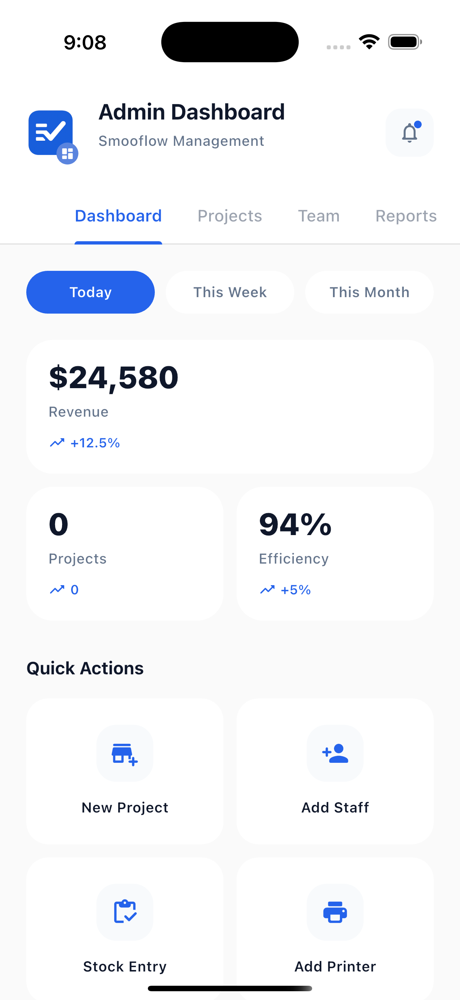</td>
    <td>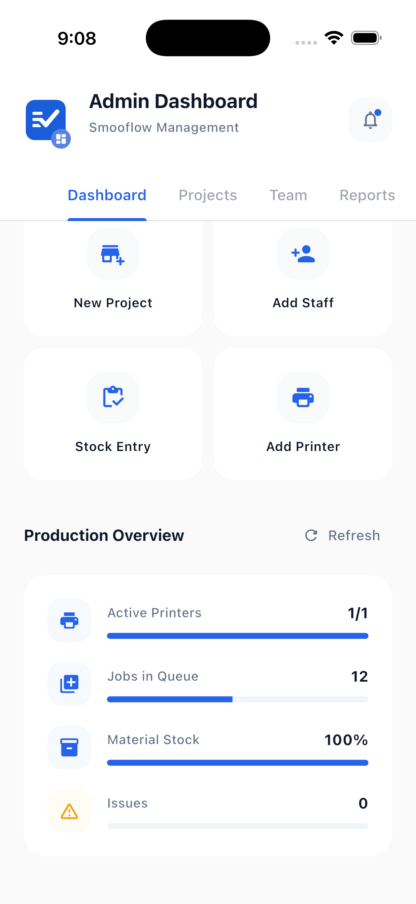</td>
    <td>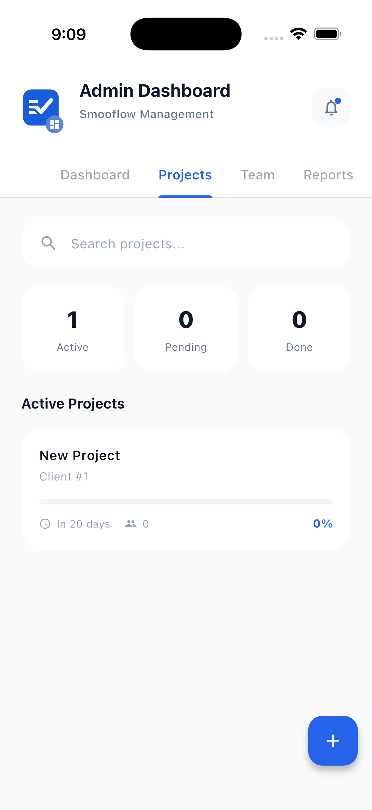</td>
    <td>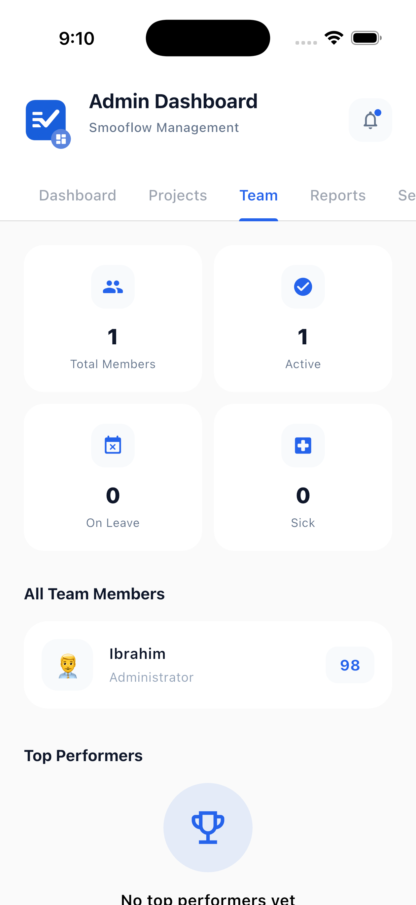</td>
  </tr>
</table>

### Reports
<table>
  <tr>
    <td></td>
    <td></td>
  </tr>
</table>

### Project
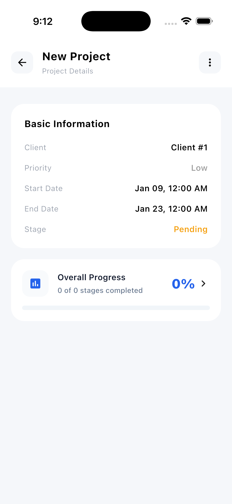

### Schedule Print Job
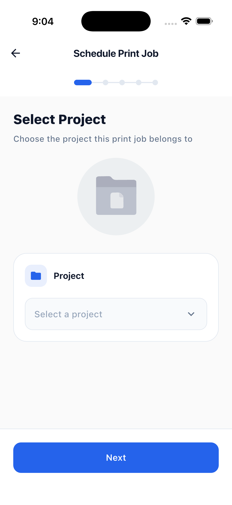
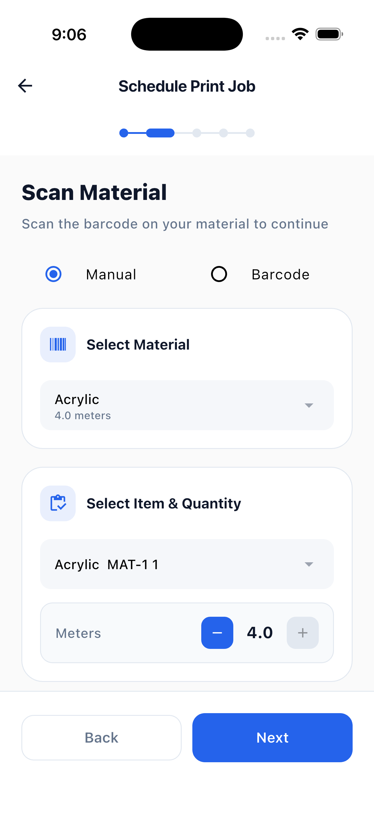
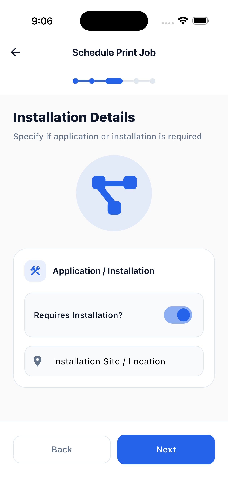
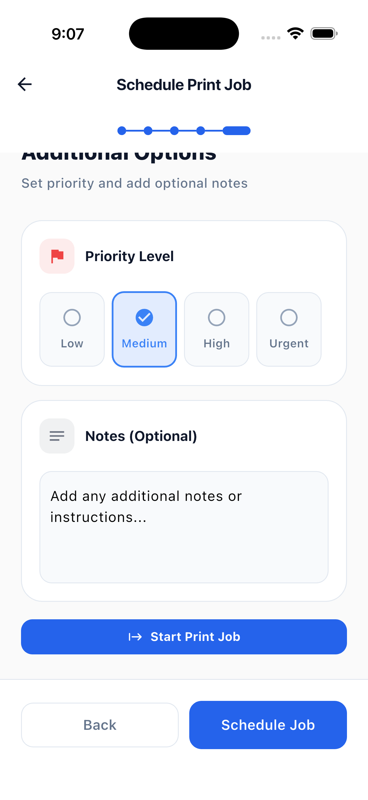

### Print Job
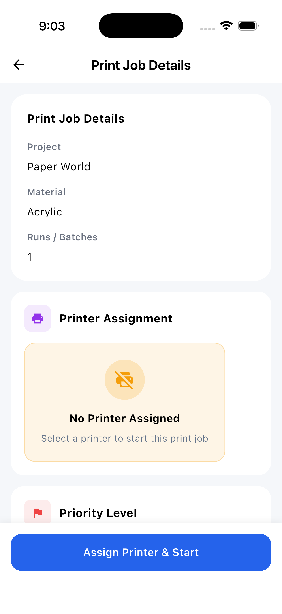

<!-- 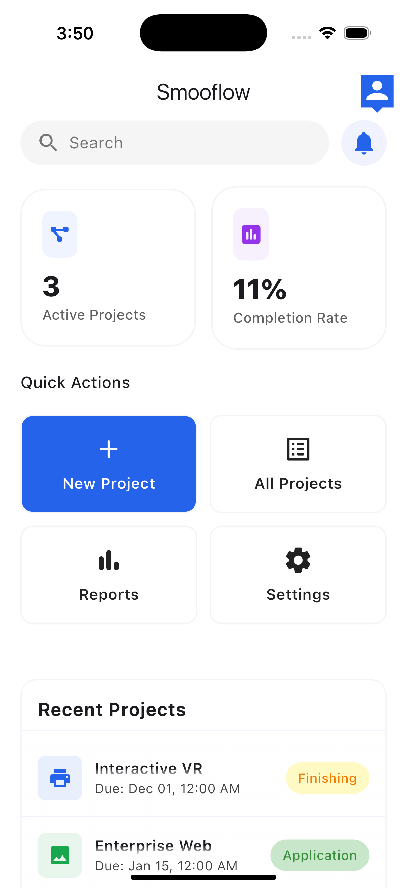 -->
### Material & Stock Management
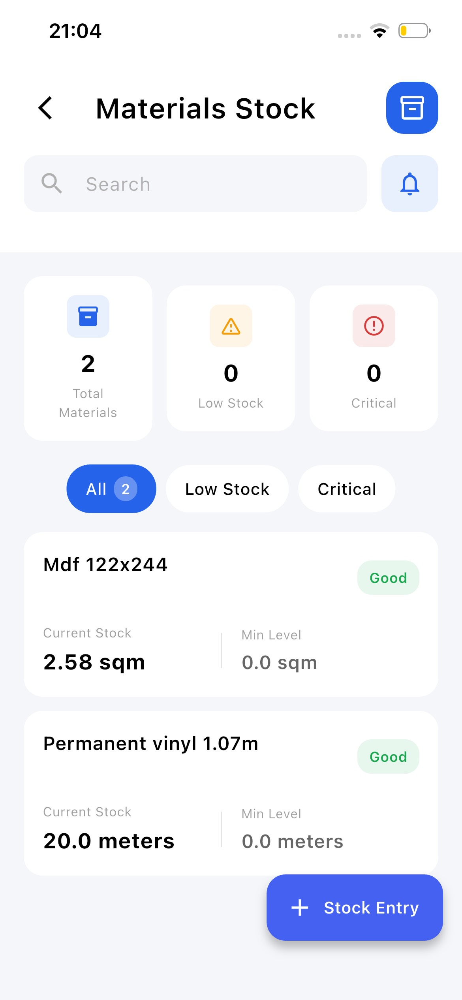
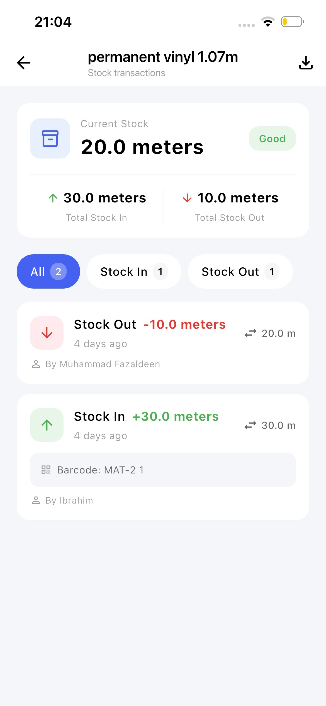
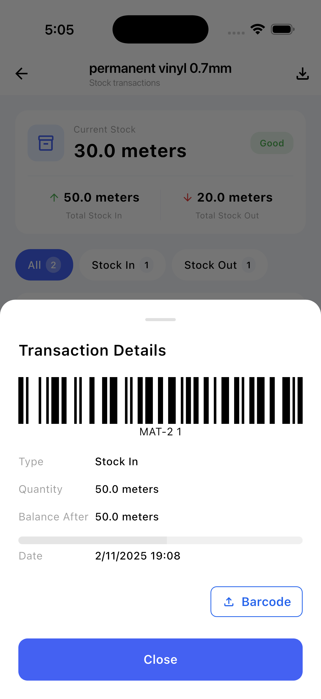
<!-- 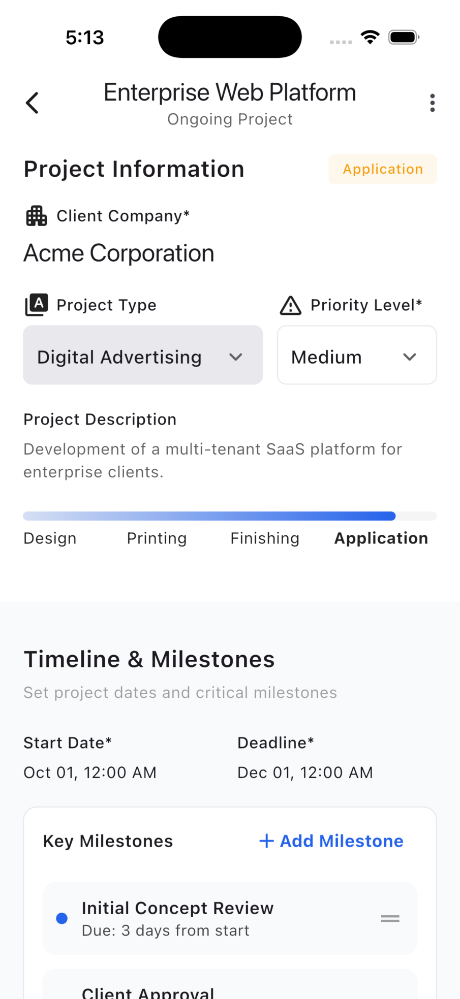
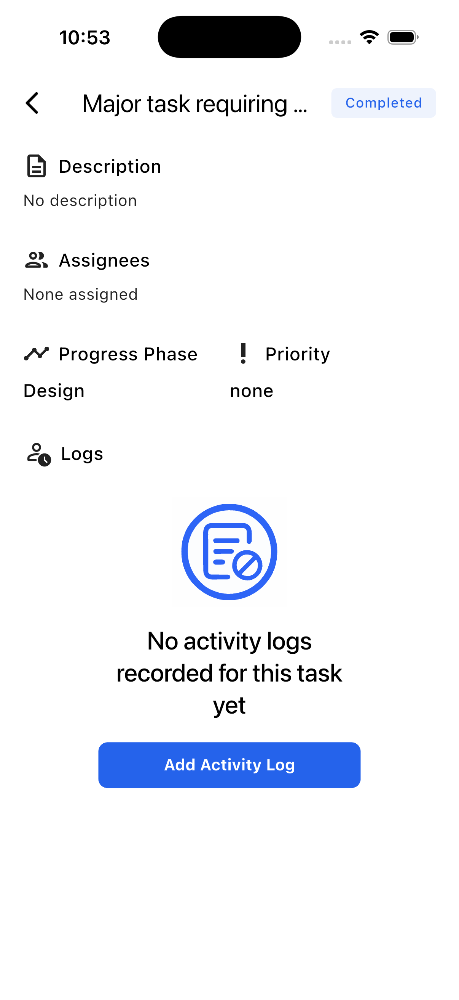
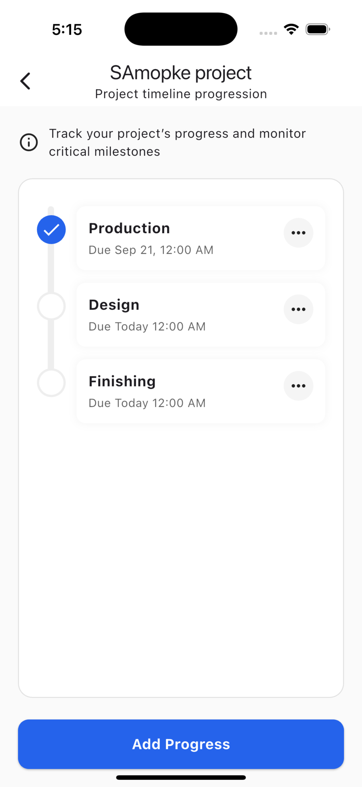
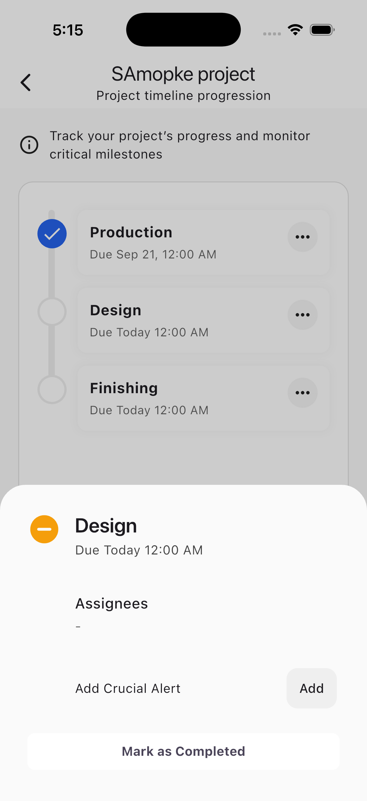 -->

### Login And Auth
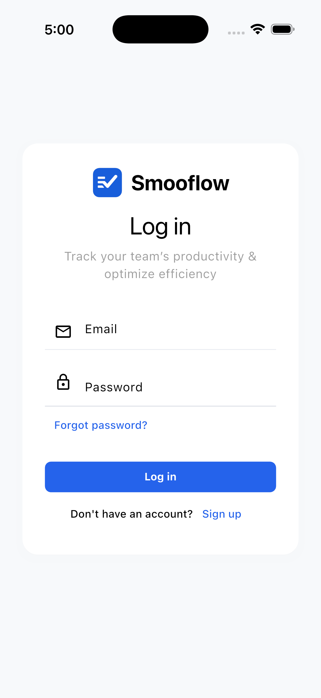

## Create Installers

### Macos
Build release:
```bash
flutter build macos --release
```
Create DMG installer:
```bash
mkdir -p build/macos/Build/Products/Release/installer                                             

create-dmg \
  --volname "Smooflow" \
  --volicon "assets/icons/logo.png" \
  --window-pos 200 120 \
  --window-size 800 400 \
  --icon-size 128 \
  --icon "smooflow.app" 200 190 \
  --hide-extension "smooflow.app" \
  --app-drop-link 600 185 \
  "build/macos/Build/Products/Release/installer/Smooflow-1.0.dmg" \
  "build/macos/Build/Products/Release/smooflow.app"
```

---

## 🔒 License

This project is **proprietary / source-available**.

The source code is visible for evaluation purposes only.
Unauthorized use, redistribution, or commercial use is prohibited.

See the [LICENSE](./LICENSE) file for details.
