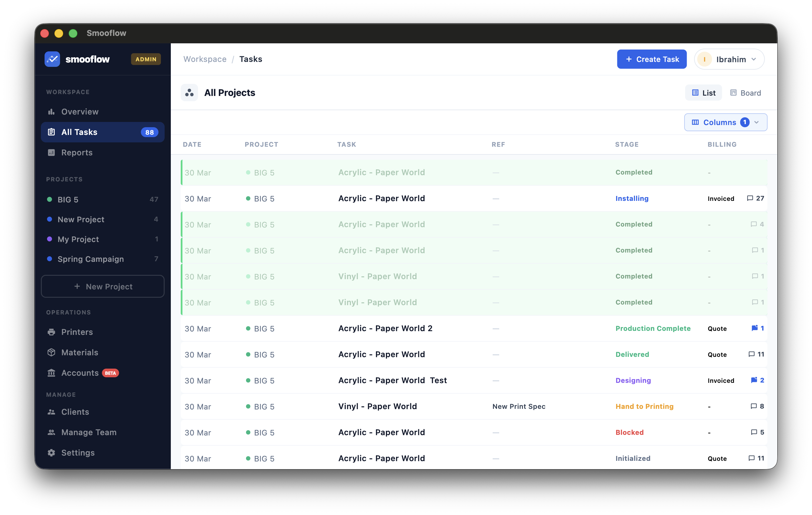
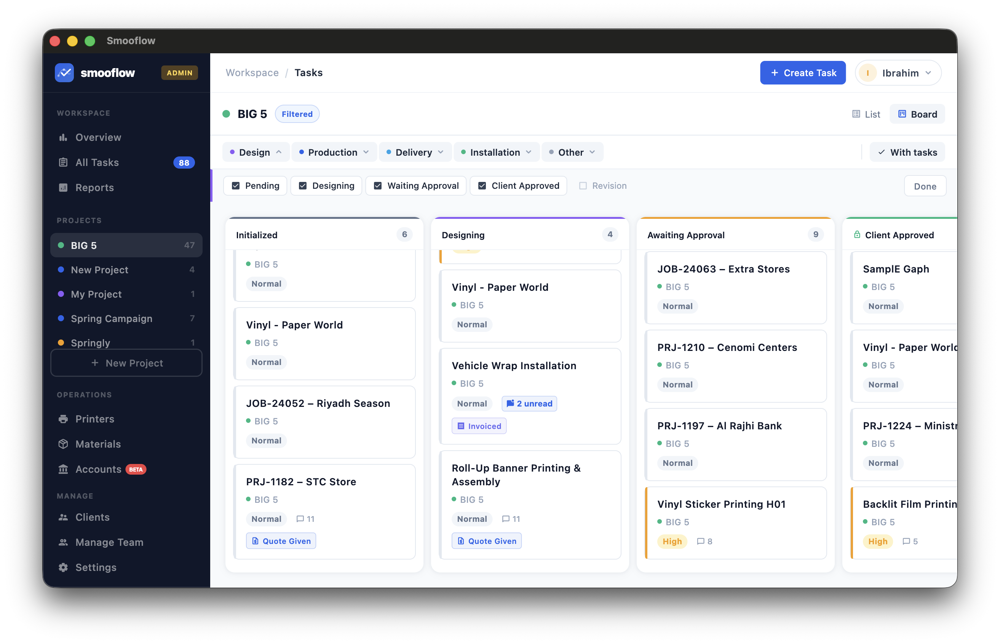
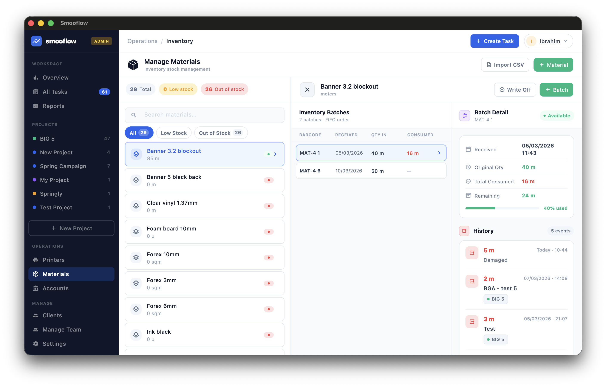
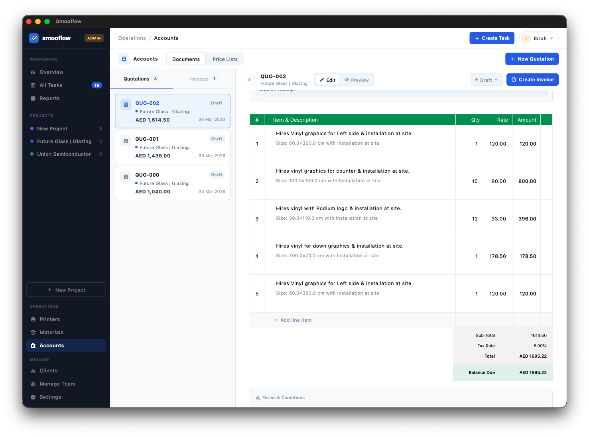
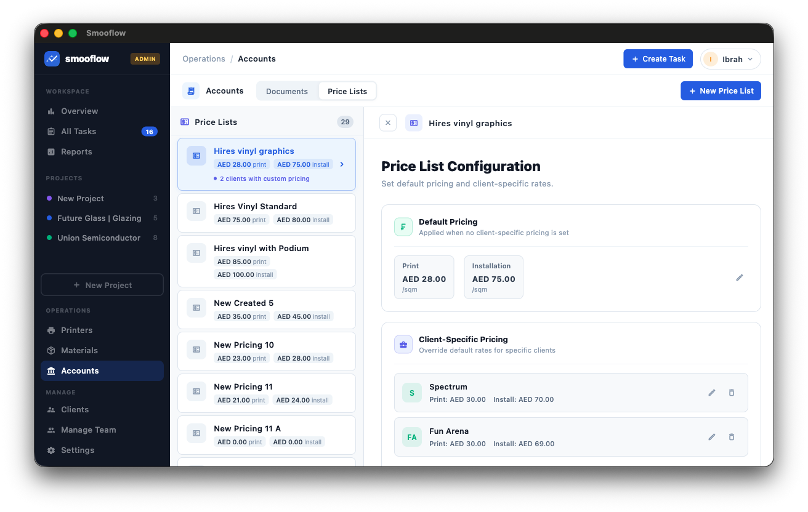

# Smooflow

## An App designed for Advertising & Digital Printing Companies

A **custom-built Flutter application** designed for advertising and digital printing companies to streamline workflows, track staff performance, and minimize waste.  
The app focuses on **project management, team collaboration, and production monitoring**, ensuring projects stay on schedule while maximizing staff efficiency.  

---

## ✨ Key Features  

### 📊 Project & Workflow Management  
- Interactive project timelines showing each department’s progress  
- Track activity, status, and tasks for each project  
- Department stages: **Planning → Design → Production → Finishing → Application → Finished/Cancelled**  

### 🎨 Design Department  
- Supports artwork submission & modifications  
- Built-in client approval/rejection workflow  
- Mandatory artwork dimension tracking  
- Restart design cycle if client disapproves  

### 🖨️ Printing Department  
- Interactive **printer layout/map view** with drag-and-drop placement  
- Assign printers with nicknames and track assigned staff  
- Live progress indicators and task statuses  
- Alerts for errors, failures, or when a printer is stuck  

### 🔧 Finishing & Application  
- Simple finishing process (MVP stage)  
- Application staff can **clock in/out**, track dimensions of work completed  
- Site in-charge approves or rejects reported progress  

### 📈 Analytics & Performance  
- Admin dashboard with project progress overview  
- Highlights **top performers** per project  
- Detects efficiency vs. estimated effort (future AI support planned)  
- Warnings if deadlines are at risk or extended timelines are needed  

### ⚡ System & Maintenance  
- Notifications for device/component failures  
- Manager alerts for urgent attention or technical intervention  
- Built-in **Notification Center** & **Global Search**  

---

## 🚀 Features & Functionality

### 🗂️ Task Management (Table & Board Views)
Effortlessly manage your workflow with flexible task visualization:
- **Table View** for structured, data-rich management  
- **Board View** for intuitive drag-and-drop progress tracking  

<p align="center">
  
</p>

<p align="center">
  
</p>

---

### 📦 Material & Stock Management
Gain complete control over your inventory with deep tracking capabilities:
- Manage **materials and their batches**
- Track **material consumption across projects**
- Drill down to **task-level usage**

<p align="center">
  
</p>

<p align="center">
  
</p>

---

### 💰 Accounts & Documents
Handle financial and documentation workflows with ease:
- Manage **Quotations and Documents**
- Maintain and update **Price Lists**

<p align="center">
  
</p>

<p align="center">
  
</p>

---

### ⚡ Smart Quotation Generation
Create detailed quotations in seconds — automatically.

- Select a **project** and generate a complete quotation instantly  
- Item descriptions are **auto-derived from task details**  
- Rates are applied from **price lists**  
- Fully customizable when needed  

**No manual entry. No repetition. Just fast, accurate quotations.**


## Create Installers

### Macos
Build release:
```bash
flutter build macos --release
```
Create DMG installer:
```bash
mkdir -p build/macos/Build/Products/Release/installer                                             

create-dmg \
  --volname "Smooflow" \
  --volicon "assets/icons/logo.png" \
  --window-pos 200 120 \
  --window-size 800 400 \
  --icon-size 128 \
  --icon "smooflow.app" 200 190 \
  --hide-extension "smooflow.app" \
  --app-drop-link 600 185 \
  "build/macos/Build/Products/Release/installer/Smooflow-1.0.dmg" \
  "build/macos/Build/Products/Release/smooflow.app"
```

### build for both intel & silicon macs
```bash
arch -x86_64 flutter build macos --release
```

## Build Release & Distrubute

### Windows

### Build Release Setup

#### Make sure `openssl` is installed
```bash
choco install openssl
```

Generate key files: <b>dsa_priv.pem, dsa_pub.pem</b>
```bash
dart run auto_updater:generate_keys
```

Build release
```bash
flutter build windows --release
```

Create updated installer
```bash
fastforge release
```

### New:
```bash
fastforge release --name prod --jobs windows-release
```

#### Sign
```bash
dart run auto_updater:sign_update dist/1.0.0/smooflow-1.0.0-windows-setup.exe
```

---

## 🔒 License

This project is **proprietary / source-available**.

The source code is visible for evaluation purposes only.
Unauthorized use, redistribution, or commercial use is prohibited.

See the [LICENSE](./LICENSE) file for details.
