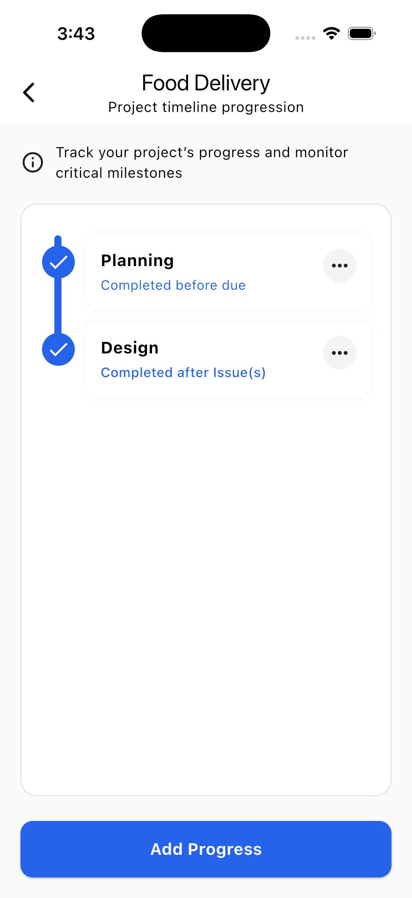
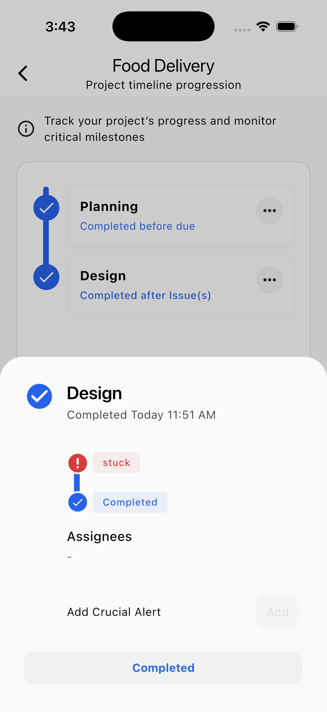

# Smooflow

## An App designed for Advertising & Digital Printing Companies

A **custom-built Flutter application** designed for advertising and digital printing companies to streamline workflows, track staff performance, and minimize waste.  
The app focuses on **project management, team collaboration, and production monitoring**, ensuring projects stay on schedule while maximizing staff efficiency.  

---

## ✨ Key Features  

### 📊 Project & Workflow Management  
- Interactive project timelines showing each department’s progress  
- Track activity, status, and tasks for each project  
- Department stages: **Planning → Design → Production → Finishing → Application → Finished/Cancelled**  

### 🎨 Design Department  
- Supports artwork submission & modifications  
- Built-in client approval/rejection workflow  
- Mandatory artwork dimension tracking  
- Restart design cycle if client disapproves  

### 🖨️ Printing Department  
- Interactive **printer layout/map view** with drag-and-drop placement  
- Assign printers with nicknames and track assigned staff  
- Live progress indicators and task statuses  
- Alerts for errors, failures, or when a printer is stuck  

### 🔧 Finishing & Application  
- Simple finishing process (MVP stage)  
- Application staff can **clock in/out**, track dimensions of work completed  
- Site in-charge approves or rejects reported progress  

### 📈 Analytics & Performance  
- Admin dashboard with project progress overview  
- Highlights **top performers** per project  
- Detects efficiency vs. estimated effort (future AI support planned)  
- Warnings if deadlines are at risk or extended timelines are needed  

### ⚡ System & Maintenance  
- Notifications for device/component failures  
- Manager alerts for urgent attention or technical intervention  
- Built-in **Notification Center** & **Global Search**  

---

## Screenshots

---

## 🖥️ UI/UX Philosophy  

- **Minimal at a glance** → Show only the most essential details on dashboards  
- **Modern, clean design** with cards & widgets for easy navigation  
- **Detailed info on demand** → Drill down into specific project, printer, or staff views  
- **Cross-platform** → Optimized for both **mobile & desktop (admin PC dashboard)**  
- **Smooth animations & haptic feedback** → Users feel interactions are real  

